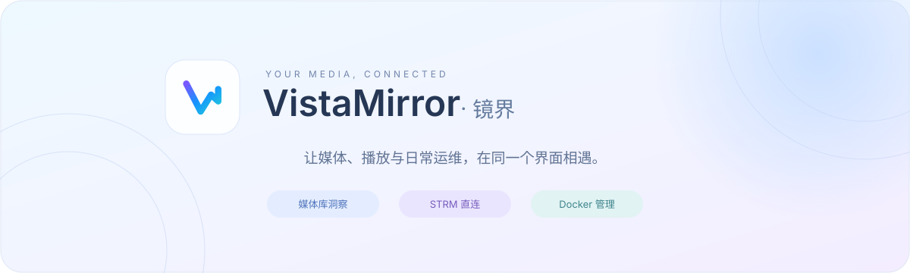
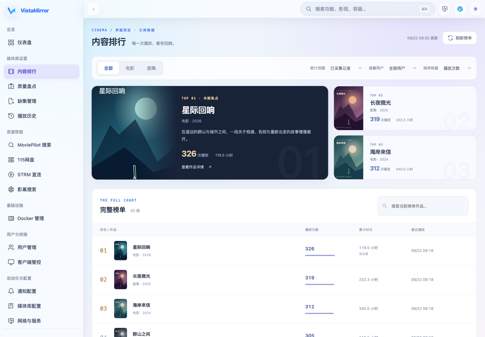
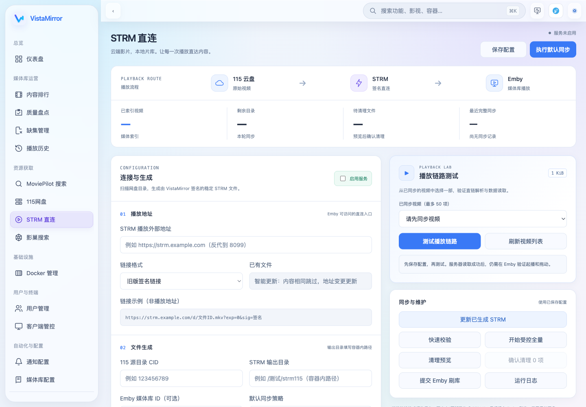

<p align="center">
  
</p>

<p align="center">
  <strong>面向 Emby / Jellyfin 的自托管媒体库管理控制台</strong>
</p>

<p align="center">
  Python 3.11 &nbsp; · &nbsp; Docker Compose &nbsp; · &nbsp; 桌面 / 移动端 &nbsp; · &nbsp;
  <a href="./LICENSE">MIT License</a>
</p>

<p align="center">
  <a href="#features">功能亮点</a> &nbsp; / &nbsp;
  <a href="#preview">界面预览</a> &nbsp; / &nbsp;
  <a href="#quick-start">快速部署</a> &nbsp; / &nbsp;
  <a href="#strm">STRM 配置</a> &nbsp; / &nbsp;
  <a href="#maintenance">更新维护</a> &nbsp; / &nbsp;
  <a href="https://github.com/fancha0/vistamirror-admin/issues">反馈问题</a>
</p>

---

## 关于 VistaMirror

VistaMirror 是一个可自行部署的 Web 管理台，将媒体库概况、内容排行、质量盘点、缺集检查、播放历史和日常运维集中到同一个界面。通过接入媒体服务器、115 网盘、MoviePilot 及通知服务，可以继续完成资源搜索、STRM 生成、播放链路测试和自动化通知。

项目提供桌面与移动端界面，支持全局搜索、播放雷达、网络连通性检测，以及 Docker Compose 部署。

<a id="features"></a>

## ✨ 功能亮点

<table>
  <tr>
    <td width="50%" valign="top"><strong>🎬 媒体库，一目了然</strong><br><br>仪表盘、最近观看与播放排行，了解片库内容和观看动态。</td>
    <td width="50%" valign="top"><strong>🔎 片库质量，集中盘点</strong><br><br>检查媒体规格、分辨率与缺失剧集，按季查看集号详情。</td>
  </tr>
  <tr>
    <td valign="top"><strong>⚡ STRM 直连播放</strong><br><br>接入 115 网盘，生成播放文件，更新链接并测试播放链路。</td>
    <td valign="top"><strong>📦 Docker 日常运维</strong><br><br>容器、Compose、镜像、运行指标与日志，在一个界面管理。</td>
  </tr>
  <tr>
    <td valign="top"><strong>🔔 通知与自动化</strong><br><br>连接通知渠道、Telegram 与 AI 服务，通过任务中心查看执行动态。</td>
    <td valign="top"><strong>🧭 随时找到所需功能</strong><br><br>全局搜索、播放雷达、连通性检测，以及桌面和手机操作入口。</td>
  </tr>
</table>

<details>
<summary><strong>查看完整功能清单与数据说明</strong></summary>

| 模块 | 主要功能 |
| --- | --- |
| 仪表盘 | 媒体库概况、最近观看、最近入库、任务动态和服务器指标 |
| 内容排行与播放历史 | 按播放次数、时长、用户和时间范围查看内容表现与播放记录 |
| 质量盘点与缺集管理 | 查看媒体规格、分辨率分布，检查剧集缺失并查看季与集详情 |
| 资源获取 | 接入 MoviePilot 搜索、115 网盘和影巢搜索 |
| STRM 直连 | 同步网盘目录、生成播放文件、更新已有链接、测试链路和查看运行日志 |
| Docker 管理 | 查看容器、Compose、镜像、运行指标、日志及操作记录 |
| 用户与客户端 | 用户管理、邀请与到期管理、客户端管控 |
| 通知与自动化 | 通知渠道配置、Telegram / AI 相关集成及任务中心 |
| 网络与服务 | TMDB 海报兜底、网络代理，以及常用服务的连通性与延迟检测 |
| 封面工坊 | 媒体库封面设计与生成 |

> 内容排行基于服务端可读取的活动日志。当前最多读取 2000 条日志，时间范围不等同于完整历史；日志缺少播放时长时可能按媒体片长估算，界面会标注。宿主机实时指标需要配置相应采集来源，仅挂载 Docker Socket 不代表所有宿主机指标都可用。

媒体服务器配置可选择 Emby 或 Jellyfin；涉及 Emby 刷库、Webhook 和播放反代的功能，按下文的 Emby 流程配置。不同服务器的接口与插件能力存在差异，不代表所有集成功能完全等价。

</details>

<a id="preview"></a>

## 🖼️ 界面预览

<table>
  <tr>
    <td width="50%" align="center"><strong>内容排行</strong></td>
    <td width="50%" align="center"><strong>STRM 直连</strong></td>
  </tr>
  <tr>
    <td><a href="./docs/screenshots/ranking-redesign/desktop.png"></a></td>
    <td><a href="./docs/screenshots/typography/desktop.png"></a></td>
  </tr>
</table>

<sub>点击图片查看大图。截图为本地界面预览，排行使用示例数据；实际内容随配置、服务状态与版本变化。</sub>

<a id="quick-start"></a>

## 🚀 快速部署

准备一台能够运行 Docker 和 Docker Compose 的服务器或 NAS。

### 1. 获取项目

```bash
git clone https://github.com/fancha0/vistamirror-admin.git
cd vistamirror-admin
```

### 2. 修改部署配置

推荐从 [docker-compose.simple.yml](./docker-compose.simple.yml) 开始。启动前修改以下配置：

```yaml
environment:
  - APP_ADMIN_AUTH_ENABLED=1
  - APP_ADMIN_USERNAME=admin
  - APP_ADMIN_PASSWORD=请替换为你自己的强密码
  - APP_INFRA_MASTER_KEY=请替换为长期保存的随机密钥
```

以上是需要修改的配置项，不是完整 Compose 文件。示例文件自带的 `admin123` 应在首次启动前替换。

使用 SSH 密码或私钥保存功能时，可运行 `openssl rand -hex 32` 生成 `APP_INFRA_MASTER_KEY`。设置后应保持不变，并与数据一起备份，否则可能无法解密已有凭据。

### 3. 启动与访问

```bash
docker compose -f docker-compose.simple.yml up -d
```

打开 `http://<服务器IP>:8091`，使用刚才配置的管理员账号登录。

| 端口 | 用途 |
| --- | --- |
| `8091` | VistaMirror 管理界面与管理 API |
| `8099` | STRM 播放入口 `/d/*`，以及配置后的 Emby Web / API 反代 |

使用自定义端口映射时，访问地址应填写**宿主机端口**。例如 `18099:8099` 的播放入口使用 `18099`。

<details>
<summary><strong>高级部署：使用 .env 集中管理配置</strong></summary>

需要集中管理环境变量时，使用 [docker-compose.yml](./docker-compose.yml)：

```bash
cp .env.example .env
# 编辑 .env，填写管理员账号、密码及需要的服务配置后再启动
docker compose up -d
```

`${APP_PORT:-8091}` 表示未设置 `APP_PORT` 时使用默认值 `8091`。两套 Compose 是替代方案，请选择其中一套，避免容器名和端口冲突。

</details>

<a id="first-run"></a>

## 🧩 首次使用

1. **连接媒体服务器**：在“媒体库配置”中选择服务器类型，填写服务端可访问的地址与 API Key，保存并测试连接。
2. **设置网络与海报**：在“网络与服务”中按需配置代理和 TMDB 海报兜底。
3. **查看媒体数据**：进入仪表盘、质量盘点、缺集管理与播放历史，确认数据读取正常。
4. **接入外部服务**：按需配置 115 网盘、MoviePilot、通知渠道和 AI 服务。
5. **启用 STRM**：先配置目录挂载和播放地址，再进行校验、同步与播放测试。

若页面提示某项“由环境变量管理”，请修改 Compose 或环境文件中的对应值，然后重建容器。

<a id="strm"></a>

## ⚡ STRM 直连配置

**115 网盘 → VistaMirror 生成 STRM → Emby 读取片库 → 播放器访问直连入口**

按顺序展开以下配置。第一次部署建议先检查目录挂载，再进行链接与播放测试。

<details>
<summary><strong>目录与挂载</strong></summary>

输出目录填写的是 **VistaMirror 容器内路径**。例如在所选 Compose 的 `volumes` 中追加：

```yaml
volumes:
  - ./data:/app/data
  - /你的宿主机媒体目录:/media
```

随后在 STRM 页面填写 `/media/strm`。不要只填写宿主机路径，却没有把它挂载进容器。

Emby 也需要能读取生成的 `.strm` 文件。请将相同宿主机目录挂载到 Emby 容器，并在 Emby 中添加对应媒体库；两个容器内的挂载路径可以不同。

</details>

<details>
<summary><strong>播放地址与同步</strong></summary>

1. 在“115 网盘”中完成账号配置。
2. 在“STRM 直连”中填写源目录 CID、输出目录和播放外部地址。
3. 播放地址指向 `8099` 对应的宿主机端口或反代域名，例如 `http://<服务器IP>:8099` 或 `https://strm.example.com`。这里不是管理端口 `8091`，也不是 Emby 原始端口 `8096`。
4. 选择链接格式，保存配置，执行快速校验和默认同步。
5. 使用“播放链路测试”检查解析与数据读取，再在 Emby 中确认实际起播与拖动。

播放地址必须能被实际使用它的 Emby 服务端或播放器访问。外网播放时，不能使用仅局域网可达的地址。

修改播放域名或链接格式后，先保存，再点击“更新已生成 STRM”，最后提交 Emby 刷库；无需为改链接重新扫描整个网盘。若 Emby 仍显示旧地址，可刷新对应影片的媒体信息。

</details>

<details>
<summary><strong>播放端反向代理</strong></summary>

独立播放域名可反代至 `8099`。以下示例假设 Nginx 运行在 Docker 宿主机上：

```nginx
location / {
  proxy_pass http://127.0.0.1:8099;
  proxy_set_header Host $host;
  proxy_set_header X-Forwarded-For $proxy_add_x_forwarded_for;
  proxy_set_header X-Forwarded-Proto $scheme;
  proxy_buffering off;
}
```

若 Nginx 在另一个容器中，应改用它能访问的服务名或宿主机地址。

Emby 刷库和播放端反代需要有效的媒体服务器配置，可在页面保存，也可通过完整版 Compose 的环境变量提供：

```dotenv
APP_EMBY_SERVER_URL=http://emby:8096
APP_EMBY_API_KEY=你的_Emby_API_Key
```

`emby` 仅适用于容器位于同一 Docker 网络且服务名为 `emby` 的情况。API Key 用于查询与刷库，不代替用户的 Emby 登录。

</details>

<a id="integrations"></a>

## 🔌 进阶配置

<details>
<summary><strong>Docker 管理权限与数据备份</strong></summary>

所提供的 Compose 默认启用本机 Docker 管理，包含以下配置：

```yaml
user: "0:0"
volumes:
  - /var/run/docker.sock:/var/run/docker.sock
```

Docker Socket 提供宿主机 Docker 管理权限，应仅交给可信的实例与管理员。如果不需要本机容器管理，可以移除该挂载及 `user: "0:0"`，并确保数据和媒体输出目录对镜像内的应用用户可写。

`./data:/app/data` 用于保存应用数据。升级或迁移前，建议停机备份 `data`、实际使用的 Compose 文件和环境配置，并保留原有加密密钥。STRM 输出目录若独立挂载，也应按需备份。

</details>

<details>
<summary><strong>固定 Webhook 地址</strong></summary>

将 `VISTAMIRROR_PUBLIC_BASE_URL` 设置为 **VistaMirror 管理端自己的外网地址**，例如：

```dotenv
VISTAMIRROR_PUBLIC_BASE_URL=https://vistamirror.example.com
```

这不是 Emby 地址，也不是 STRM 专用播放地址。配置后，在通知页面复制实际生成的 Webhook 地址和令牌。旧变量 `BOT_PUBLIC_BASE_URL` 仍兼容，建议新部署使用前者。

</details>

<details>
<summary><strong>管理员凭据</strong></summary>

- Compose 中的 `APP_ADMIN_USERNAME` 与 `APP_ADMIN_PASSWORD` 用于配置管理员登录。
- 也可以使用应用支持的 `APP_ADMIN_PASSWORD_HASH`；同时设置时，明文密码优先。
- 修改环境变量后，使用 `docker compose -f docker-compose.simple.yml up -d --force-recreate` 重建容器生效；完整版部署去掉 `-f` 参数。
- 管理端公开访问时，应配置 HTTPS 并保持管理员认证开启。

</details>

<details>
<summary><strong>影巢一键授权代理</strong></summary>

一键授权代理使用独立的 [docker-compose.hdhive-broker.yml](./docker-compose.hdhive-broker.yml)。在影巢“我的应用”中登记 `https://<代理域名>/oauth/callback`，并为代理配置：

```dotenv
HDHIVE_BROKER_PUBLIC_URL=https://<代理域名>
HDHIVE_BROKER_CLIENT_ID=影巢应用_ClientID
HDHIVE_BROKER_APP_SECRET=影巢应用_Secret
HDHIVE_BROKER_ENCRYPTION_KEY=至少24字符的随机密钥
```

将这些变量提供给 Compose 后，执行：

```bash
docker compose -f docker-compose.hdhive-broker.yml up -d
```

代理需通过 HTTPS 访问。普通 VistaMirror 实例填写 `APP_HDHIVE_BROKER_URL`，无需保存影巢应用 Secret。授权范围为 `meta query unlock write`，其中 `write` 用于普通签到。

</details>

<a id="maintenance"></a>

## 🔄 更新与维护

```bash
# 拉取镜像并重建容器
docker compose -f docker-compose.simple.yml pull
docker compose -f docker-compose.simple.yml up -d

# 查看状态与日志
docker compose -f docker-compose.simple.yml ps
docker compose -f docker-compose.simple.yml logs -f

# 重启
docker compose -f docker-compose.simple.yml restart
```

回滚时，将 Compose 中的 `image` 改为镜像仓库实际存在的旧标签或已记录的镜像摘要，再拉取并重建。镜像回滚不会自动恢复数据，升级前请保留备份。

<a id="development"></a>

## 🛠️ 开发与飞牛测试

<details>
<summary><strong>展开项目结构、开发部署与测试命令</strong></summary>

后端使用 Python，前端为原生 HTML、CSS 与 JavaScript。容器基于 Python 3.11，依赖见 [requirements.txt](./requirements.txt)。

| 路径 | 内容 |
| --- | --- |
| `dev_server.py` | Web 服务、API 与集成入口 |
| `backend_modules/` | 媒体、STRM、通知、Docker 等后端模块 |
| `runtime/` | 前端页面、样式、脚本与品牌资源 |
| `tests/` | Python 与 Node.js 回归测试 |
| `scripts/` | 部署与运维脚本 |
| `docs/` | 功能说明与相关文档 |

### 飞牛独立开发环境

开发部署脚本需要本机具备 SSH、rsync，远端具备 Docker / Compose：

```bash
cp .fnos-dev.env.example .fnos-dev.env
# 修改 SSH 目标、远端目录、媒体路径、管理员凭据与 Emby 配置
./scripts/deploy_fnos_dev.sh
```

请先检查 [.fnos-dev.env.example](./.fnos-dev.env.example)，其中的示例地址和路径不是你的环境配置。

默认开发管理端口为 `18091`、播放端口为 `18099`，开发容器名为 `vistamirror-admin-dev`。脚本同步源码并在远端构建，开发数据位于 `${FNOS_DEV_ROOT}/source/data-dev`；请使用独立开发目录，避免与正式实例共用数据。

### 前端回归测试

本机安装 Node.js 后可运行：

```bash
node --test tests/*.cjs
```

Python 测试需要安装 [requirements.txt](./requirements.txt) 中的依赖；具体模块测试见 `tests/`。页面预览、自动化测试通过与实际服务器部署成功是不同的验收步骤。

</details>

<a id="feedback"></a>

## 💬 反馈与贡献

欢迎通过 [GitHub Issues](https://github.com/fancha0/vistamirror-admin/issues) 提交问题。请附上版本、部署方式、复现步骤及必要日志，并隐去 API Key、Cookie、Token 和签名播放链接等访问凭据。

本项目采用 [MIT License](./LICENSE)。

---

<p align="center">
  <br>
  <strong>VistaMirror · 镜界</strong><br>
  <sub>让媒体服务集中可见。</sub><br><br>
  <a href="#">返回顶部 ↑</a>
</p>
